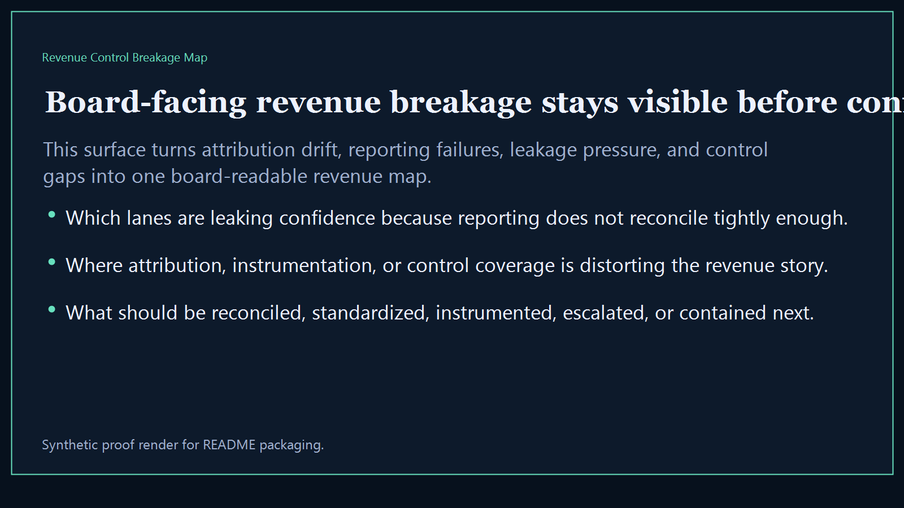
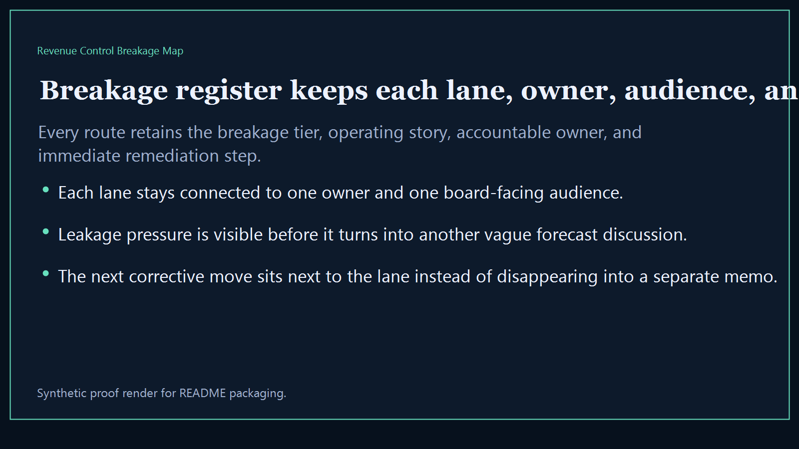
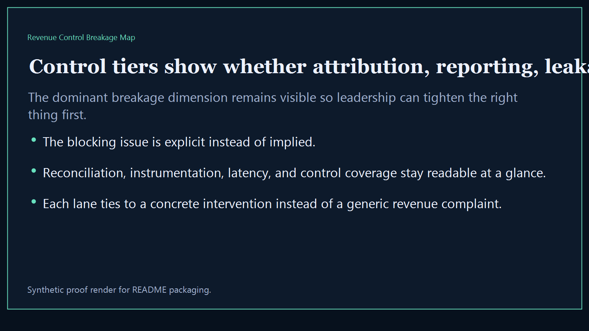
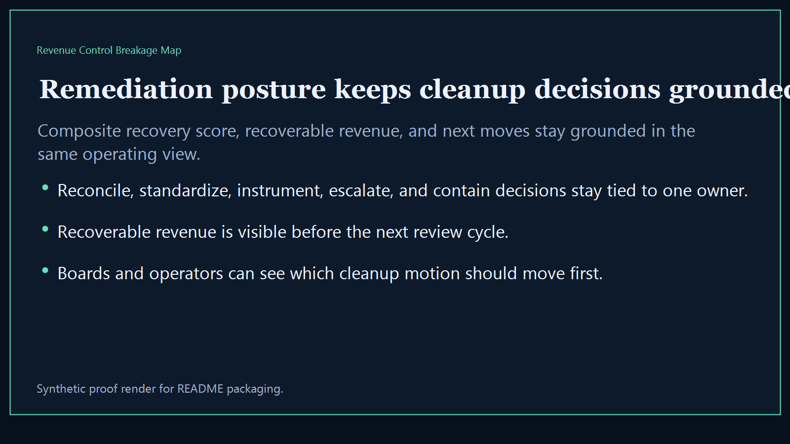

# Revenue Control Breakage Map

Board-ready executive-intelligence surface for exposing revenue-control failures, reporting breakage, attribution drift, and operator-visible leakage across the broader Kinetic Gain suite.

- Live: `https://breakage.kineticgain.com/`
- Repo: `mizcausevic-dev/revenue-control-breakage-map`

## Why this matters

Leaders need one breakage map that shows where revenue reporting is misfiring, where controls are leaking trust, and which system failures deserve intervention before the next board or investor review.

## What it includes

- TypeScript executive-intelligence surface for tracking revenue-control breakage, reporting failures, and leakage pressure
- synthetic lanes across multiple sectors, owner groups, and board-visible control failures
- reusable outputs for breakage register, control tiers, remediation posture, and board-ready revenue narratives
- prerendered static site, JSON payloads, screenshots, and docs

## Routes

- `/`
- `/breakage-register`
- `/control-tiers`
- `/remediation-posture`
- `/verification`
- `/docs`

## Local run

```bash
cd revenue-control-breakage-map
npm install
npm run verify
npm run prerender
npm run render:assets
```

## CLI

```bash
npx revenue-control-breakage-map fixtures/revenue-control-breakage-map.json --format summary
npx revenue-control-breakage-map fixtures/revenue-control-breakage-map-clean.json --format json
```

## Docs

- [Architecture](docs/architecture.md)
- [Origin](docs/ORIGIN.md)
- [Kinetic Gain Embedded](docs/KINETIC_GAIN_EMBEDDED.md)

## Screenshots





